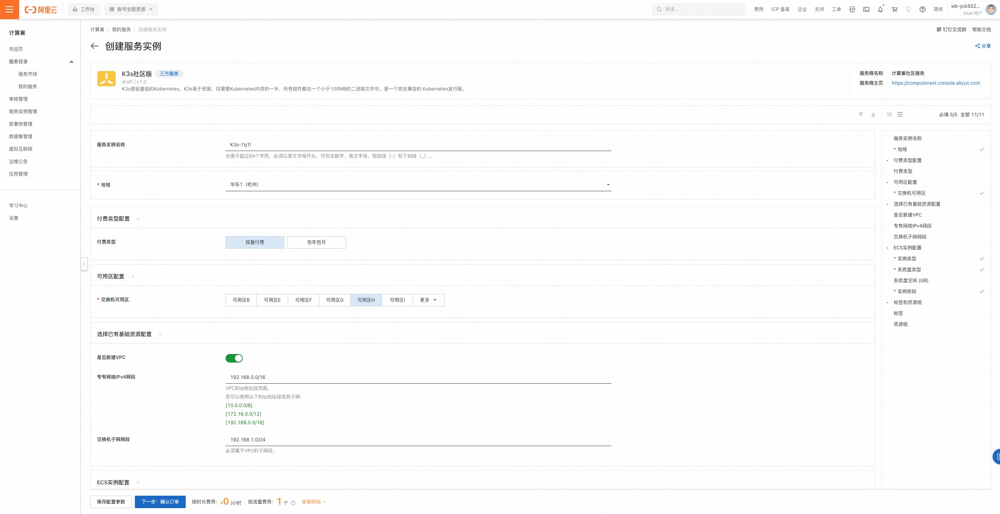
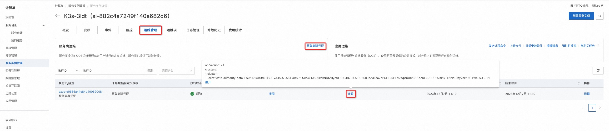
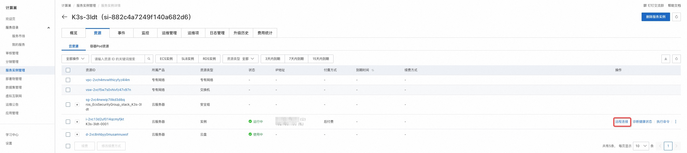
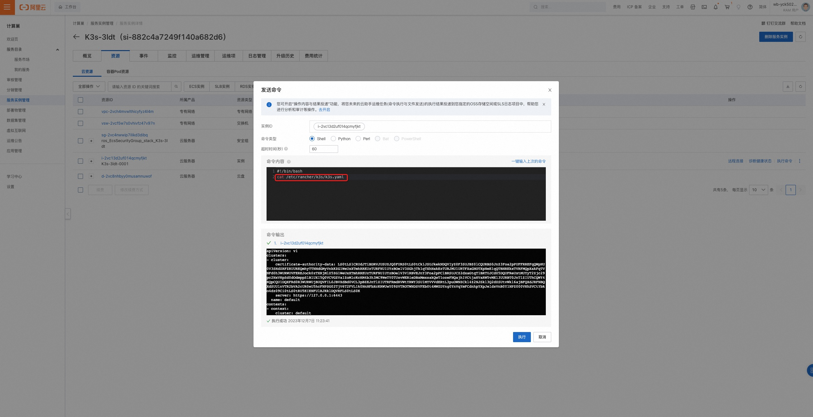
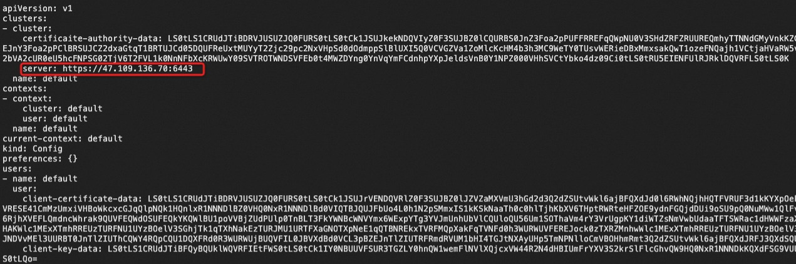
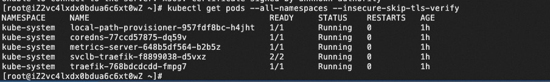

# K3s社区版服务实例部署文档

## 概述

[K3s](https://docs.k3s.io/zh/)是一个完全兼容的 Kubernetes 发行版，具有以下增强功能：

- 打包为单个二进制文件。
- 使用基于 sqlite3 作为默认存储机制的轻量级存储后端。同时支持使用 etcd3、MySQL 和 Postgres。
- 封装在简单的启动程序中，可以处理很多复杂的 TLS 和选项。
- 默认情况下是安全的，对轻量级环境有合理的默认值。
- 添加了简单但强大的 batteries-included 功能，例如：
    - 本地存储提供程序
    - service load balancer
    - Helm controller
    - Traefik ingress controller
- 所有 Kubernetes control plane 组件的操作都封装在单个二进制文件和进程中。因此，K3s 支持自动化和管理复杂的集群操作（例如证书分发等）。
- 最大程度减轻了外部依赖性，K3s 仅需要现代内核和 cgroup 挂载。K3s 打包了所需的依赖，包括：
    - containerd
    - Flannel (CNI)
    - CoreDNS
    - Traefik (Ingress)
    - Klipper-lb (Service LB)
    - 嵌入式网络策略控制器
    - 嵌入式 local-path-provisioner
    - 主机实用程序（iptables、socat 等）

本文向您介绍根据K3s社区版服务部署实例的流程和使用说明。

## 计费说明

K3s社区版在计算巢上的费用主要涉及：

- 所选vCPU与内存规格
- 磁盘容量
- 公网带宽

计费方式包括：

- 按量付费（小时）
- 包年包月

预估费用在创建实例时可实时看到。

## 部署架构

K3s社区版是单机部署架构。

## RAM账号所需权限

K3s社区版服务需要对ECS、VPC等资源进行访问和创建操作，若您使用RAM用户创建服务实例，需要在创建服务实例前，对使用的RAM用户的账号添加相应资源的权限。添加RAM权限的详细操作，请参见[为RAM用户授权](https://help.aliyun.com/document_detail/121945.html)
。所需权限如下表所示。

| 权限策略名称                          | 备注                         |
|---------------------------------|----------------------------|
| AliyunECSFullAccess             | 管理云服务器服务（ECS）的权限           |
| AliyunVPCFullAccess             | 管理专有网络（VPC）的权限             |
| AliyunROSFullAccess             | 管理资源编排服务（ROS）的权限           |
| AliyunComputeNestUserFullAccess | 管理计算巢服务（ComputeNest）的用户侧权限 |
| AliyunCloudMonitorFullAccess    | 管理云监控（CloudMonitor）的权限     |

## 部署流程

### 部署步骤

单击[部署链接](https://computenest.console.aliyun.com/service/instance/create/cn-hangzhou?type=user&ServiceId=service-2f7333225ee342ee8fa7)
，进入服务实例部署界面，根据界面提示，填写参数完成部署。

### 部署参数说明

您在创建服务实例的过程中，需要配置服务实例信息。下文介绍K3s社区版服务实例输入参数的详细信息。

| 参数组        | 参数项    | 示例           | 说明                                                                        |
|------------|--------|--------------|---------------------------------------------------------------------------|
| 服务实例名称     |        | test         | 实例的名称                                                                     |
| 地域         |        | 华东1（杭州）      | 选中服务实例的地域，建议就近选中，以获取更好的网络延时。                                              |
| 可用区配置      | 部署区域   | 可用区I         | 地域下的不同可用区域                                                                |
| 付费类型配置     | 付费类型   | 按量付费 或 包年包月  |
| 选择已有基础资源配置 | VPC ID | vpc-xxx      | 选择专有网络的ID。                                                                |
| 选择已有基础资源配置 | 交换机ID  | vsw-xxx      | 选择交换机ID。若找不到交换机, 可尝试切换地域和可用区                                              |
| ECS实例配置    | 实例类型   | ecs.g6.large | 实例规格，可以根据实际需求选择                                                           |
| ECS实例配置    | 系统盘空间  | 40           | 系统盘空间，可以根据实际需求选择                                                          |
| ECS实例配置    | 数据盘空间  | 40           | 数据盘空间，可以根据实际需求选择                                                          |
| ECS实例配置    | 实例密码   | ********     | 设置实例密码。长度8~30个字符，必须包含三项（大写字母、小写字母、数字、()`~!@#$%^&*-+={}[]:;'<>,.?/ 中的特殊符号） |




### 验证结果

1. 查看服务实例。
   服务实例创建成功后，部署时间大约需要2分钟。部署完成后，页面上可以看到对应的服务实例。

2. 获取集群访问凭证:
    - 方式1：运维管理页中，选择执行"获取集群凭证"运维项，在执行结果中查看凭证
        

    - 方式2：远程连接服务节点，获取访问凭证：/etc/rancher/k3s/k3s.yaml
        

    - 方式3：发送远程命令: cat /etc/rancher/k3s/k3s.yaml，查看命令的执行结果
        
        

3. 在集群外的节点配置凭证访问集群:
    - 私网访问：在~/.kube/config中写入凭证文件，把凭证中的server-ip替换为服务实例的私网Ip（在概览页获取），使用kubectl命令访问集群
        
        
        ```
        kubectl get pods --all-namespaces
        ```
    - 公网访问：在~/.kube/config中写入凭证文件，把凭证中的server-ip替换为服务实例的公网Ip（在概览页获取），使用kubectl命令访问集群
        ```
        kubectl get pods --all-namespaces --insecure-skip-tls-verify
        ```
        


### 使用K3s

请访问K3s官网了解如何使用K3s：[K3s使用文档](https://docs.k3s.io/zh/)
